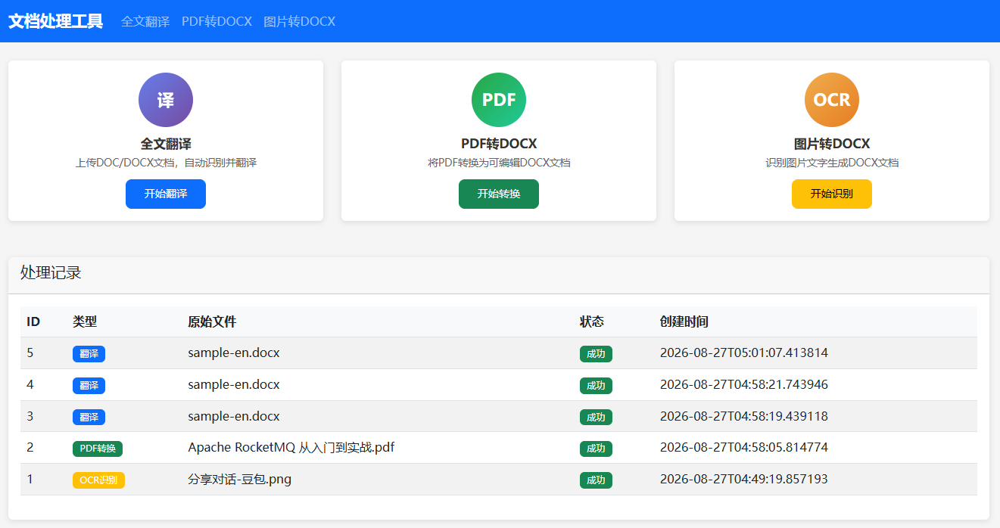

# Doc-Tool

[](https://www.oracle.com/java/)
[](https://spring.io/projects/spring-boot)
[](LICENSE)

在线文档处理平台，提供文档翻译、PDF 转换、OCR 识别三大核心功能。纯后端渲染，开箱即用，无需额外前端构建。

<div align="center">

</div>

## 功能特性

### 文档翻译
上传 DOC/DOCX 文件，自动翻译全文内容，保留原始排版（字号、加粗、居中、缩进等）。翻译完成后自动清理评估水印。

### PDF 转 DOCX
将 PDF 文件提取文本内容并转换为可编辑的 Word 文档。

### 图片 OCR 转 DOCX
识别图片中的文字并生成 Word 文档，尽量还原原始版式。采用双引擎架构：
- **RapidOCR**（默认）— PaddleOCR ONNX 模型，中文识别准确率高，纯本地运行，无需联网
- **Tesseract**（回退）— 当 RapidOCR 加载失败时自动切换

支持异步任务机制，前端轮询获取结果，不会阻塞页面。

## 技术栈

| 类别 | 技术 |
|------|------|
| 后端框架 | Spring Boot 3.2.5, Spring MVC |
| 持久层 | MyBatis 3.0.3, H2 嵌入式数据库 |
| 模板引擎 | Thymeleaf |
| 文档处理 | Apache POI 5.2.5, Apache PDFBox 3.0.2 |
| OCR 引擎 | RapidOCR 0.0.7 + Tess4J 5.11.0 |
| 前端 | Bootstrap 5.3, 响应式布局 |
| 构建工具 | Maven, 静态资源内容哈希（HashAssets） |

## 环境要求

- JDK 17+
- Maven 3.6+

## 快速开始

### 1. 克隆项目

```bash
git clone https://github.com/talenxie/doc-tool.git
cd doc-tool
```

### 2. 运行

```bash
mvn spring-boot:run
```

### 3. 访问

打开浏览器访问 http://localhost:8081

> OCR 功能默认使用内置的 RapidOCR 引擎，无需额外安装。如需使用 Tesseract 作为回退，可运行 `install-tesseract.bat` 安装，并设置环境变量 `TESSDATA_PATH`。

## 页面说明

| 路径 | 功能 |
|------|------|
| `/` | 首页，展示功能入口和任务历史记录 |
| `/translate` | 文档翻译页面 |
| `/pdf-convert` | PDF 转 Word 页面 |
| `/ocr` | 图片 OCR 识别页面 |
| `/h2-console` | H2 数据库管理控制台 |

## 项目结构

```
src/main/java/com/doctool/
├── DocToolApplication.java          # 启动类
├── config/
│   └── CorsConfig.java              # 跨域配置
├── controller/
│   ├── HomeController.java          # 页面路由
│   ├── TranslateController.java     # 翻译 API
│   ├── PdfConvertController.java    # PDF 转换 API
│   └── OcrController.java           # OCR API
├── mapper/
│   └── TaskRecordMapper.java        # 任务记录 Mapper
├── model/
│   ├── TaskRecord.java              # 任务记录实体
│   └── OcrLine.java                 # OCR 行数据模型
├── service/
│   ├── TranslateService.java        # 翻译业务
│   ├── PdfConvertService.java       # PDF 转换业务
│   └── OcrService.java              # OCR 识别业务
└── util/
    ├── DocxUtils.java               # Word 文档工具
    └── PdfUtils.java                # PDF 工具

build-tools/
└── HashAssets.java                  # 构建时为静态资源生成内容哈希
```

## 打包部署

### WAR 包部署（默认）

```bash
mvn clean package -DskipTests
# 部署 target/doc-tool-1.0.0.war 到 Tomcat 10+
```

### JAR 包运行

将 `pom.xml` 中 `<packaging>war</packaging>` 改为 `<packaging>jar</packaging>`，移除 Tomcat provided 依赖后：

```bash
mvn clean package -DskipTests
java -jar target/doc-tool-1.0.0.jar
```

### 生产环境

通过 `-Pprod` 激活生产环境配置：

```bash
mvn clean package -Pprod -DskipTests
```

## 扩展说明

### 接入翻译 API

当前默认使用 Google Translate，可通过 `TranslateService.java` 中的 `callTranslateApi` 方法替换为百度翻译、DeepL、有道等服务。

### 切换数据库

默认使用 H2 嵌入式数据库，数据文件保存在 `./data/doctool.mv.db`。如需切换到 MySQL，修改 `application.yml` 中的数据源配置即可。

## License

[MIT](LICENSE)
